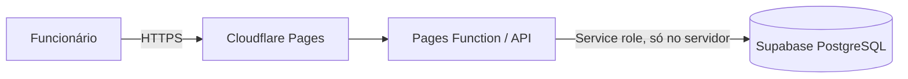

# Gestão da Frota de Bicicletas — Parques Tejo

## Versão 1.11.1

- Ações operacionais colocadas no topo do dashboard dos funcionários: novo aluguer, devolução, avaria, frota e fecho diário.
- Relatório executivo em PDF, com identidade Parques Tejo, indicadores, gráficos e período selecionado.
- Exportação CSV mantida para tratamento detalhado dos dados.
- Distinção automática entre alugueres pagos, gratuitos (`0,00 €`) e histórico anterior sem valor conhecido.
- Valor Multibanco associado a cada aluguer, incluindo alugueres gratuitos com valor zero.
- Indicadores administrativos de procura, duração média, receita, dias da semana, quiosques e tipologias.
- Registo automático dos períodos em que um quiosque fica sem bicicletas disponíveis, distinguindo falta por procura e capacidade mista.
- Comparação no fecho diário entre o valor declarado e a soma dos alugueres registados.
- Alertas automáticos de novas avarias para administradores e perfis de Manutenção.
- Sino no cabeçalho, contador de notificações não lidas e ligação direta para a ocorrência.
- Fila de email com bloqueio, idempotência e até cinco tentativas através da API Resend.
- Interface sem caixas nativas bloqueantes: validações, confirmações e resultados aparecem dentro da aplicação.
- Criação de utilizadores e redefinição de palavras-passe através de formulários com confirmação dupla.
- Frontend dividido por áreas funcionais em `src/pages/`.
- Backend dividido entre utilitários partilhados e rotas de inventário, alugueres, avarias/utilizadores e fechos/atividade.
- Testes adaptados à estrutura modular e verificação automática de que não regressam `alert()`, `prompt()` ou `confirm()`.

Aplicação interna para os Quiosques de Mobilidade da Praia da Torre e do Terrapleno de Algés. O frontend é React/TypeScript, a API corre em Cloudflare Pages Functions e os dados são guardados em PostgreSQL/Supabase.

**Se não tem experiência técnica, comece pelo ficheiro `GUIA_INSTALACAO_SIMPLES.md`.**

## Arquitetura



O navegador nunca recebe a `service_role` nem contacta diretamente a base de dados. A API valida a sessão, o token CSRF, as permissões e os dados. As operações com várias bicicletas são efetuadas por funções PostgreSQL numa única transação.

## Modelo de dados

| Entidade | Finalidade |
|---|---|
| `kiosks` | Dois quiosques e respetivo estado |
| `users` / `sessions` | Utilizadores sem email, perfis e sessões por hash |
| `bikes` / `bike_status_history` | Ficha, estado, localização e histórico da bicicleta |
| `rentals` / `rental_items` | Aluguer e bicicletas incluídas; suporta devolução parcial |
| `faults` | Ocorrências de avaria |
| `maintenance_interventions` | Uma ou várias intervenções por avaria |
| `audit_log` | Rastreio das ações críticas |
| `login_attempts` | Limitação de tentativas repetidas de autenticação |
| `daily_closures` | Fechos diários, totais automáticos, receita declarada e referência ao talão privado |
| `rental_discrepancies` | Divergências comunicadas durante a correção de alugueres |

## Funcionalidades implementadas

- Autenticação exclusiva por nome de utilizador e palavra-passe, sem email.
- PBKDF2-SHA-256 com salt individual e 100.000 iterações, o limite suportado pelo runtime do Cloudflare; sessões opacas armazenadas por hash.
- Cookies `HttpOnly`, `Secure` e `SameSite=Strict`, proteção CSRF e limitação a cinco tentativas em 15 minutos.
- Perfis Administrador e Funcionário, validados no backend.
- Dashboard com estados reais, distribuição por quiosque, alugueres em aberto, devoluções recentes e avarias pendentes.
- Frota, filtros, criação e alteração administrativa, desativação sem apagar histórico.
- Aluguer de uma ou várias bicicletas, transacional, com valor cobrado por Multibanco; o valor zero identifica um aluguer gratuito.
- Devoluções parciais, mudança de quiosque e criação automática de avaria.
- Avarias, passagem para manutenção e conclusão com escolha explícita do estado final.
- Funcionários podem comunicar uma avaria sem consultar ocorrências, reparações ou histórico de manutenção; a gestão fica reservada a administradores e manutenção.
- Histórico de estados e auditoria das ações críticas.
- Fecho diário integrado, com vigilante e quiosque pré-preenchidos, contagem automática de alugueres e bicicletas por tipologia, rascunho, submissão, talão privado e observações.
- Consulta global, filtros, exportação CSV e reabertura de fechos para administradores.
- Correção de alugueres em aberto, com adição ou remoção de bicicletas e comunicação de discrepâncias.
- Inventário unificado de bicicletas elétricas, convencionais e infantis, capacetes, cadeados e carrinhos de bebé.
- Vista operacional dos funcionários limitada aos itens localizados nos quiosques de aluguer, incluindo todos os respetivos estados; Armazém, Evento e outras localizações internas ficam excluídos.
- Contacto opcional do cliente disponível apenas durante o aluguer em aberto e eliminado automaticamente na devolução completa, sem integração no histórico ou na auditoria.
- Página própria e simplificada para iniciar um novo aluguer, separada dos resumos, alugueres em aberto e histórico de devoluções.
- Os acessórios são geridos explicitamente no inventário; não existe reposição automática por quiosque.
- Dashboard administrativo com atividade diária, semanal e mensal, receita declarada, os três últimos relatórios de final de dia de cada quiosque, inventário operacional disponível/alugado, ocorrências, observações, comparação temporal e exportação CSV.
- Matriz da frota por localização, tipologia e estado, permitindo consultar diretamente quantas bicicletas elétricas, convencionais e infantis e quantos acessórios existem em cada situação.
- Interface responsiva e em português de Portugal.
- Seed de instalação com os dois quiosques, 20 bicicletas elétricas e 10 convencionais.

## Instalação local

Requisitos: Node.js 20 ou superior, npm, uma conta gratuita Supabase e uma conta gratuita Cloudflare.

1. Crie um projeto no Supabase e abra **SQL Editor**.
2. Execute, por ordem:
   - `supabase/migrations/001_initial.sql`
   - `supabase/migrations/002_operations.sql`
   - `supabase/migrations/003_bike_types.sql`
   - `supabase/migrations/004_support_locations.sql`
   - `supabase/migrations/005_maintenance_role.sql`
   - `supabase/migrations/006_daily_closures.sql`
   - `supabase/migrations/007_rental_corrections.sql`
   - `supabase/migrations/008_children_and_accessories.sql`
   - `supabase/migrations/009_transient_contacts_and_accessories.sql`
   - `supabase/migrations/010_rental_concurrency.sql`
   - `supabase/migrations/011_inventory_fault_integrity.sql`
   - `supabase/migrations/012_fault_notifications.sql`
   - `supabase/migrations/013_rental_management_analytics.sql`
   - `supabase/migrations/014_pdf_reports_and_free_rentals.sql`
   - `supabase/seed.sql`
3. Copie `.env.example` para `.dev.vars` e preencha os valores. Nunca publique `.dev.vars`.
4. Instale e execute:

```bash
npm install
npx wrangler pages dev --proxy 5173 -- npm run dev
```

Em alternativa, execute `npm run dev` para o frontend e `npx wrangler pages dev dist --port 8788` para a API, ajustando o proxy do Vite se necessário.

### Atualização de uma instalação existente

Numa instalação já atualizada até à versão 1.10.0, execute apenas `supabase/migrations/014_pdf_reports_and_free_rentals.sql` antes de publicar este código. Se ainda não executou a migração `013`, execute primeiro a `013` e depois a `014`. Não volte a executar o `seed` nem as migrações anteriores.

A antiga carga de 8 capacetes e 2 cadeados por quiosque foi uma operação pontual já concluída. Não existe qualquer reposição automática desses artigos.

## Primeiro administrador

Com `BOOTSTRAP_TOKEN` temporariamente configurado, execute uma única vez:

```bash
curl -X POST http://localhost:8788/api/bootstrap \
  -H "Content-Type: application/json" \
  -H "X-Bootstrap-Token: O_SEU_TOKEN_TEMPORARIO" \
  -d '{"full_name":"Administrador","username":"admin","password":"UMA_SENHA_LONGA_E_UNICA"}'
```

Depois de confirmar o acesso, remova `BOOTSTRAP_TOKEN` das variáveis locais e do Cloudflare. O endpoint recusa nova configuração quando já existe qualquer utilizador.

## Publicação no Cloudflare Pages

1. Coloque o projeto num repositório Git privado.
2. No Cloudflare Pages, escolha esse repositório.
3. Defina o comando de build como `npm run build` e a pasta de saída como `dist`.
4. Em **Settings → Environment variables**, configure `SUPABASE_URL`, `SUPABASE_SECRET_KEY` (ou a chave antiga `SUPABASE_SERVICE_ROLE_KEY`) e, apenas no primeiro arranque, `BOOTSTRAP_TOKEN`.
5. Para alertas por email, configure também `RESEND_API_KEY`, `ALERT_EMAIL_FROM` e `ALERT_EMAIL_TO`. O domínio do remetente tem de estar validado no Resend; vários destinatários podem ser separados por vírgulas.
6. Não defina `COOKIE_SECURE=false` em produção.
7. Publique, crie o administrador pelo endpoint `/api/bootstrap` e remova imediatamente `BOOTSTRAP_TOKEN`.

Os planos gratuitos eram adequados à arquitetura à data de preparação, mas os limites e termos dos fornecedores podem mudar e devem ser confirmados antes da publicação institucional.

## Fotografias e documentos

Os talões de fecho diário são guardados num bucket privado do Supabase Storage, criado pela migração `006_daily_closures.sql`. O acesso é sempre efetuado através da API autenticada; o bucket não deve ser tornado público.

## Backup e recuperação

- No painel Supabase, use os backups disponibilizados no plano em vigor.
- Para uma cópia manual regular, utilize `pg_dump` com a connection string do projeto, guardando o ficheiro cifrado e com acesso restrito:

```bash
pg_dump "$DATABASE_URL" --format=custom --no-owner --file=frota_$(date +%F).dump
```

- Teste a recuperação periodicamente num projeto separado:

```bash
pg_restore --clean --if-exists --no-owner --dbname="$RESTORE_DATABASE_URL" frota_DATA.dump
```

- Antes de restaurar produção, interrompa temporariamente a utilização e valide o ponto de restauro. A recuperação substitui dados e deve ser autorizada pelo responsável.

## Testes

```bash
npm test
npm run build
```

Estes testes rápidos incluem testes unitários do domínio simplificado e verificações estruturais de regressão. Não substituem testes da aplicação contra PostgreSQL real.

Existe também uma suite de integração para executar exclusivamente num projeto Supabase de teste isolado:

```bash
TEST_SUPABASE_URL="https://PROJETO-DE-TESTE.supabase.co" \
TEST_SUPABASE_SERVICE_ROLE_KEY="CHAVE-APENAS-DO-PROJETO-DE-TESTE" \
INTEGRATION_TEST_CONFIRMATION="TEST_DATABASE_CAN_BE_CLEARED" \
npm run test:integration
```

Esta suite chama as funções SQL reais e verifica alugueres simultâneos, devoluções concorrentes, eliminação do contacto, atualização transacional de avarias e proteção quando existe outra avaria pendente. Nunca utilize credenciais de produção: os testes criam e eliminam registos.

## Segurança e operação

- Gere o `BOOTSTRAP_TOKEN` com pelo menos 32 bytes aleatórios e remova-o depois da configuração inicial.
- Rode a chave `service_role` se esta for exposta e revogue todas as sessões.
- Reveja periodicamente utilizadores ativos e o `audit_log`.
- Configure retenção/anonimização dos nomes de clientes segundo a política interna. A coluna `customer_ref` pode ser substituída por `Anonimizado` pelo administrador sem remover as métricas do aluguer; deve ser acrescentado um botão específico quando a política de retenção estiver definida.
- Limpe periodicamente sessões expiradas e tentativas antigas com uma tarefa SQL agendada ou manutenção manual.

## Limitações conhecidas

- O upload privado está implementado para os talões de fecho diário; outros anexos continuam sem interface própria.
- O registo de intervenções dispõe da tabela completa, mas a interface inicial atualiza o estado da ocorrência; um formulário detalhado de intervenção é evolução imediata recomendada.
- Os filtros avançados por data/funcionário estão representados nos dados, mas a interface inicial privilegia pesquisa operacional simples.
- Não existe modo offline. A aplicação depende de ligação à internet e dos limites gratuitos dos fornecedores.
- A limitação de login usa a base de dados; para maior escala, pode ser complementada por Cloudflare Turnstile ou Rate Limiting.

## Evoluções futuras — não implementadas

- Upload privado de fotografias e documentos.
- Formulário completo para intervenções e custos de manutenção.
- Anonimização automática por prazo de retenção definido.
- Notificações externas e reservas.
- Migração para servidor próprio mantendo PostgreSQL e a mesma API.
